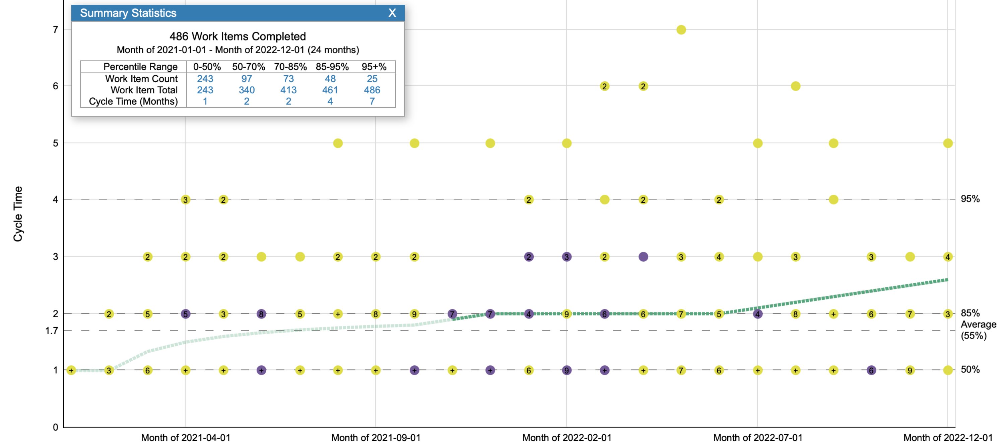

# Glossary

**Cycle Time**

The time difference between start and end of a work item. 
A trend of cycle time helps team to assess its efficiency and identify steps of improvement.

**Definition of done**
The quality measure of a team's work. TBD

