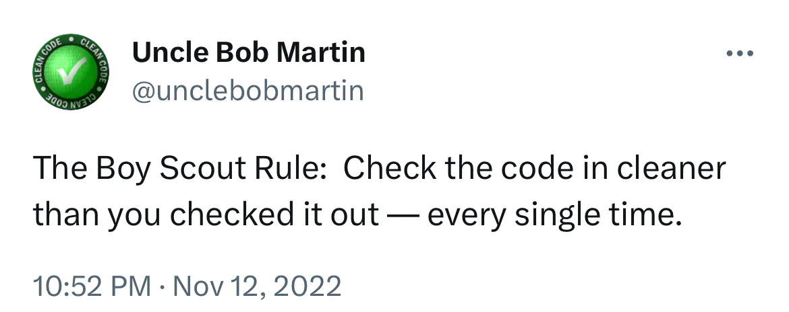

# Not Techincal debt.. that's irresponsible software development

*“Yeah, we know we have technical debt. We have added a dedicated epic in our backlog for quality related items and will pick as soon as we have some bandwidth from business deliverables”* — A typical reaction to poor software quality question

> Postponing quality is not technical debt, its irresponsible software development.

Be it the lack of automated testing, code maintainability issues or team’s inability to continuously integrate and deliver. Do it later attitude just makes things worse.

## Some popular "buts", and why they don't make sense
 
**But, our focus is delivery right now, we will improve quality later**
Focusing on timely delivery must not be an excuse for writing substandard code and lack of automated tests. Postponing quality compromises the customer’s right to timely delivery, as it allows potential bugs to be discovered later on, ultimately doing a disservice to the investment made.

**But, we inherited this legacy codebase**
Garbage tends to attract more garbage. Don’t let the legacy of the past define the future of software development efforts. Follow the “Boy scout rule”. Clean as you go.

**But, we just started this as a PoC for this new platform/technology evaluation**
Why shouldn’t a technical evaluation involve how quality will be handled? Any evaluation without consideration on adherence to good design principles and quality assurance is incomplete. While its understandable to acquire short term technical debt to validate assumptions faster, its important to pay back the debt before its grows out of hand.

**But, our business wants us to focus on development first**
Code and test quality is an integral aspect of software development. It should not be seen as a separate activity. If business asks to quick delivery, they also have the right to know the risk involved due to bad quality and its impact in future. Maintaining that trasparency is team’s responsibility.

Do the right thing. Build your software with quality as a pre-requisite.

Some book references to get started

- <a href="https://www.amazon.sg/Working-Effectively-Legacy-Michael-Feathers/dp/0131177052/ref=sr_1_1?crid=2BC689F1BPBXH&keywords=working+effectively+with+legacy+code&qid=1687924860&sprefix=working+effectiv%2Caps%2C3233&sr=8-1" target="_blank"> Working effectively with legacy code</a>
- <a href="https://www.amazon.sg/Clean-Code-Handbook-Software-Craftsmanship/dp/0132350882/ref=sr_1_1?crid=3GCTUSRXAYURO&keywords=Clean+code&qid=1687924884&sprefix=clean+cod%2Caps%2C270&sr=8-1" target="_blank"> Clean code</a>
- <a href="https://www.amazon.sg/Test-Driven-Development-Kent-Beck/dp/0321146530/ref=sr_1_2?keywords=tdd+by+example&qid=1687924912&sprefix=TDD+by+exam%2Caps%2C248&sr=8-2" target="_blank"> TDD by Example</a>
- <a href="https://www.amazon.sg/Unit-Testing-Principles-Automation-Integration/dp/1617296279/ref=sr_1_1?crid=38J5F0WOEPA5J&keywords=Unit+testing&qid=1687924963&sprefix=unit+testi%2Caps%2C261&sr=8-1" target="_blank"> Unit testing: Principles, practices and patterns</a>

