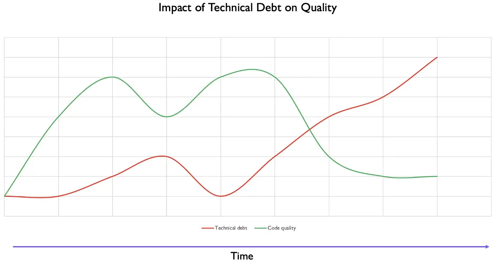

# Technical Debt — How to Identify, manage and minimise?

**Technical debt** is a metaphor to represent an act of borrowing when developers choose to make certain design decisions in current circumstances to attain quick validation of assumptions/ideas with low fidelity solutions, and hence borrowing time in the exchange of certain quality attributes.
These design decisions, when not aligned with evolving product understanding in the future, may negatively impact quality of product and productivity of team. This term was coined by **Ward Cunninghum** and inspired from the concept of financial debt.

In this story, I want to share some experiences on the causes, identifiers, and techniques for managing and minimising the technical debt.

## What am I borrowing and how?

**Time to market**: You may borrow for the ability to ship quicker in order to provide certain capabilities to customer or business. This might mean that in order to deliver faster, team may have cut corners on design, and quality. And that’s where team acquires technical debt

Examples
1. Importing dependencies on some external/open source libraries to save time, when product may not need the full features of the library or are not certain of its quality
2. Sub-optimal design and structure of code, hard-coded configurations to expedite delivery

**Learning**: Or you may borrow for ability to learn by experimentation and feedback. There are fair chances that after shipping the product, team’s understanding will evolve, and it might invalidate certain assumptions on the model and design. In such a case, the invalidated model becomes a technical debt.

Examples

1. The team identifies domains and objects based on a certain understanding of product, and the understanding changes after review and feedback from business or customer.
2. A rudimentary UI developed to learn from customer behaviour and interaction with the system. Based on the learning, the nature of UI may need to change

## So, I know that I borrowed, what if I don’t pay back?

Technical debt as acquired, directly impacts the code quality. If paid back, it improves the quality. The longer technical debt is kept unattended, the more interest team may end up paying as
1. A change that was easier to make earlier, will become harder subsequently, as the design will be out of sync from the new product understanding.
2. Over a period of time, code will get harder to understand and maintain
3. Technical debt has a tendency to attract more debt. If left unattended, it extends to other modules, as team loses discipline.
4. As the understanding gets impacted, the cycle time to process requests will also increase impacting the development and delivery capability of the team
5. In case the reason for team’s debt was importing some external or open source libraries to gain speed, the product quality will now also depends on the quality and maintenance of the referenced library and any other internal references that it may in turn have. This will require a constant watch at vulnerabilities and upgrades on referenced libraries and their impact on product.

In essence, if team doesn’t pay back technical debt in principal, what it pays rather is interest, which gets heavier with time.

## How to manage technical debt?
1. Add a due date for paying back the technical debt — A date after which, if unpaid, the debt is likely to hurt the product design, quality and team performance
2. Allocate certain capacity per sprint to address technical debt and improving design
3. Keep a threshold for technical debt to ensure that it does not exceed a certain number to ensure quality standards of product.
4. Don’t acquire new debt if you have already reached a threshold for your technical debt.

## How to minimize technical debt?

**Test driven development (TDD)**: The focus of TDD is not ability to test alone. Its more about design. Practising TDD forces developers to think about design, and create objects that reflect the understanding of the domain. Externalizing the thinking through with automated tests, followed by code, ensures quality at the same time. TDD minimises chances of acquiring debt, and if there is any, due to gap of domain understanding, it also helps to quickly pay-back by building developer confidence through tests.

**Review**: Code review provides an opportunity for team members to read and understand the code, and exchange views on improving design and quality. The best form of review through pair programming where team members sit together to discuss, code an validate together. Reviews are great way to spot design and quality issues early, and hence helps to avoid debt that might inadvertently be acquired.

**Refactoring**: Refactoring is a discipline to change the internal structure of the code without impacting the external behaviour, so while it remains transparent to customer or end user, its meant to improve the quality and structure of the code make it more clean, understandable and maintainable. Refactoring is not meant to be scheduled, its an exercise that goes on continuously as we work on code, to keep it clean and simple to understand. Follow the boy scout rule from Uncle bob.

**Standards**: Coding standards and practices bring common understanding and discipline in the development team. It also helps establish a common vocabulary and thought process for developers to code with, and in turn ensuring readability and maintainability of the code. Documenting, maintaining and following coding standards, helps team from inadvertently introducing crappy code, that may turn into debt at some point.

In summary, while acquiring some technical debt in short term, may serve some specific purpose for the team, in a longer term it may make you bankrupt. So manage your technical finances wisely :)

