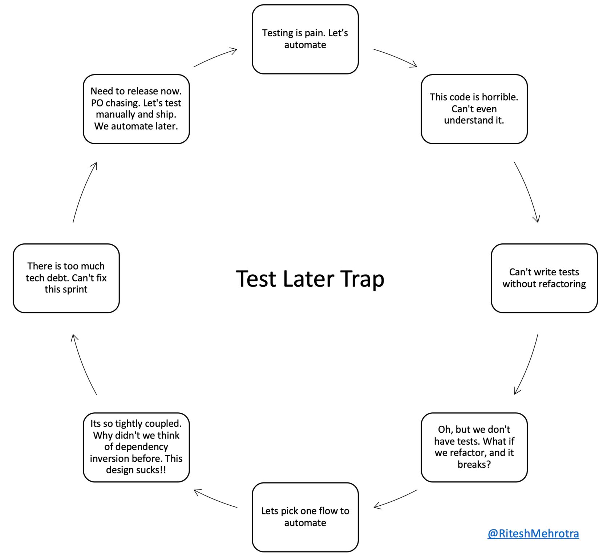

# Test Later Trap

Don't fall into the test later trap. Testing later can get really expensive and hurt your ROI. The gap between writing code and writing tests, has a direct impact on understandability ( i.e. developer's understanding of what code does) and testability( i.e. ability to test the code).

Don't let it reach a point where you don't even recognise your own code.

Test first!

