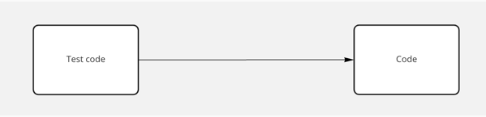
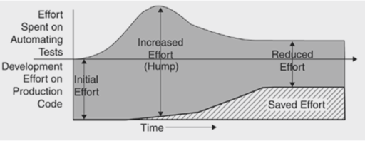
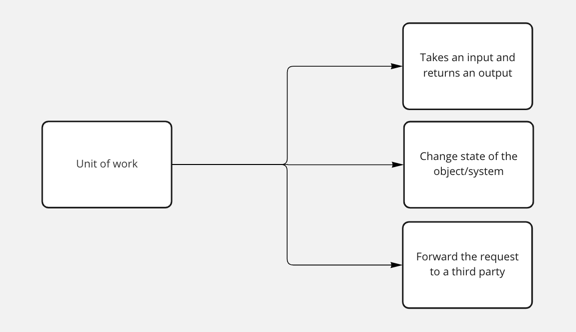

# Understanding Unit testing

## What is a unit test?

## Why do we need unit tests?
- Builds developer confidence in code
- Makes future changes easier
- Helps to improve software quality.
- Helps to understand the system behaviour.
- Strengthens deployability of the code

## Cost of automated testing

> Reference: xUnit Test patterns – Gerard Meszaros

## How big is a unit?

- Is instantiating an object a unit of work?
- Are getter/setters a unit of work?
- Or is a CRUD operation a unit of work?

A unit of work is

## Principles of unit testing

- Deterministic
- Automated
- Quick to run
- Should not fail when code’s internal structure changes
- Should fail when the behavior of code changes
- Cheap to read, write and change
- Tests should reduce (and not introduce) risk.
- Tests should be isolated and not dependent on each other