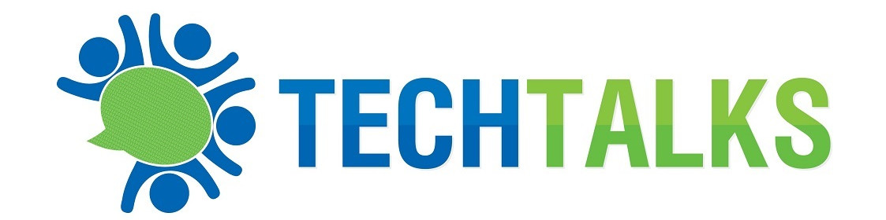

# Introduction

Hello! My name is **Ritesh Mehrotra**. I am an Enterprise and Technical agility practitioner and coach. 

This journal is an aggregation of my work and experience working in various roles as Software Developer, Tech Consultant and coach with different organizations.

I offer coaching and mentoring services in following areas
- Organizational agility: Culture and skill building, Coaching and facilitation skills
- Product agility: Product discovery, Customer centricity, Development and delivery management
- Technical agility: Software design, Quality, DevOps and best development practices 

I am a keen contributor on agile transformation initiatives.

As a strong believer in community driven growth with collaborative learning, 
I host a community for technology enthusiasts named <a target="_blank" href="https://www.meetup.com/techtalkssg/">TechTalks</a>, which is a knowledge sharing platform on Meetup. 
Apart from being a rich knowledge sharing platform, TechTalks serves as a networking ground for entrepreneurs, professionals and tech enthusiasts to meet and exchange ideas.

## Join the TechTalks community
